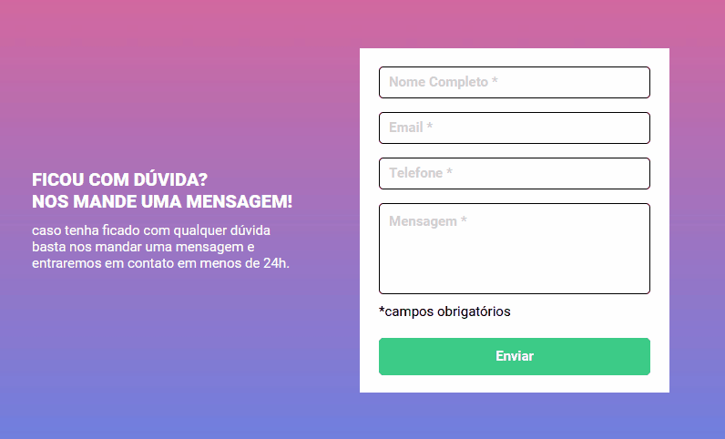

## Bem-vindo(a) ao meu perfil

 

   
   

    

 
    
    
    

 
 

## Sobre

Este projeto é um exercício desafio que realizei no curso DEVQUEST. Foi utilizado html, css e javascript para construção de um formulário que alertasse caso um campo obrigatório não estivesse preenchido ao ser enviado.

### Exercício proposto 

Crie um formulário

  * A validação do formulário deve ser feita com 
    javascript puro.

  * Ao clicar para enviar o formulário, se caso
    algum campo não estiver preenchido, a borda
    do input deve ficar vermelha e uma mensagem
    de "campo obrigatório" deve aparecer embaixo
    do campo que não foi preenchido, conforme o
    figma.

  * O fundo do formulário deve ser feito usando a
    imagem em anexo na aula.

### Considerações Finais

Será acrescentado no futuro.

## Animação demonstrativa do site

